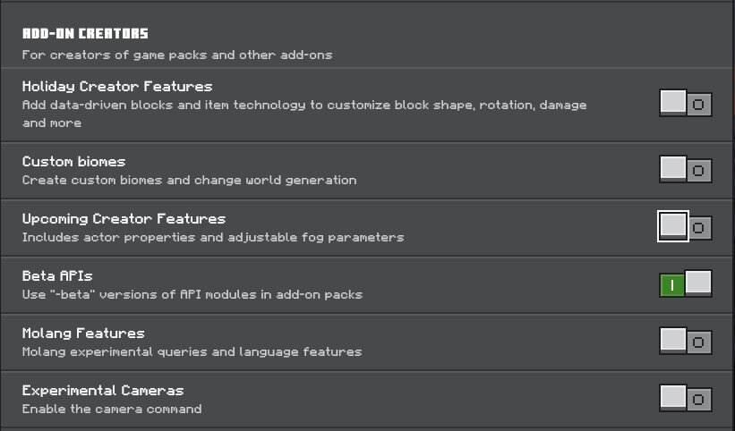

# Single Player Sleep
Skips to day when a player sleeps.
## Installation
Go the [releases page](https://github.com/fireflowerr/SinglePlayerSleep/releases/) and grab the latest release. Double click on the .mcaddon file to install. 
To use this mod, **beta apis must be enabled**.
